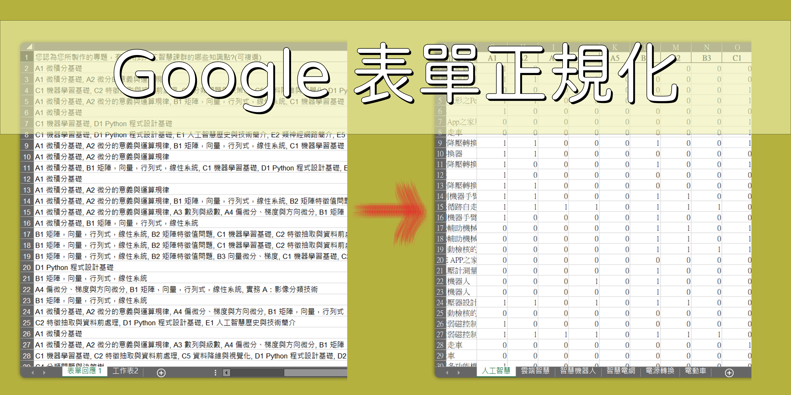

# Google 表單正規化



## Overview

將高雄科技大學電機工程系 A 類計畫期末問卷的 Google 表單，每個問題選項的回答正規化，拆分成單獨的選項提供後續分析。

## Usage

建立 python 虛擬環境，並安裝依賴套件。

```
pip install -r requirements.txt
```

執行 `main.py` 來輸出轉換 Google 表單。

- main.py

    主要程式，修改 `helper.run()` 的輸出與輸出路徑來轉換檔案。

- input(xlsx)

    輸入檔案的資料夾，輸入檔案為是 xlsx。

- output(xlsx)

    輸出檔案的資料夾，將以副檔名 xlsx 格式輸出。
